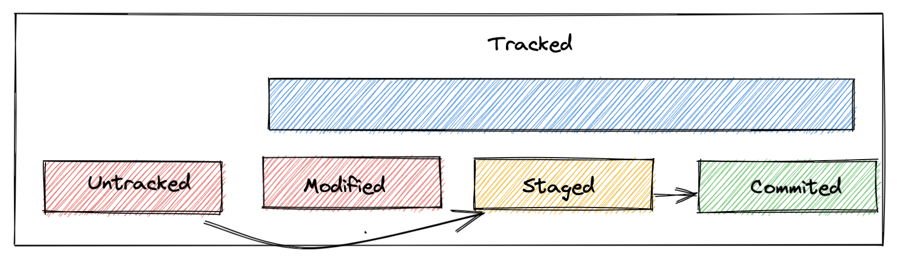
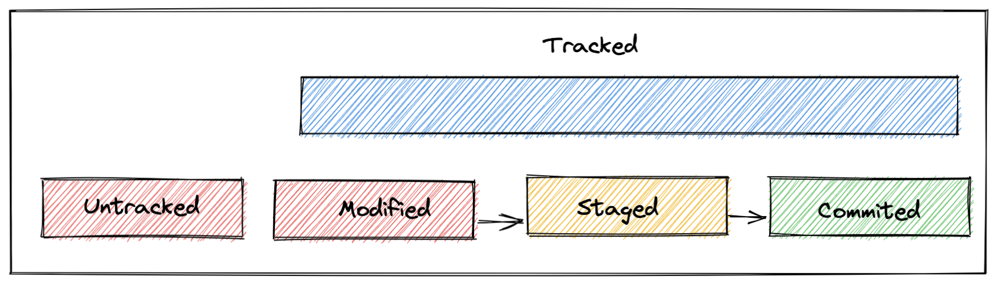
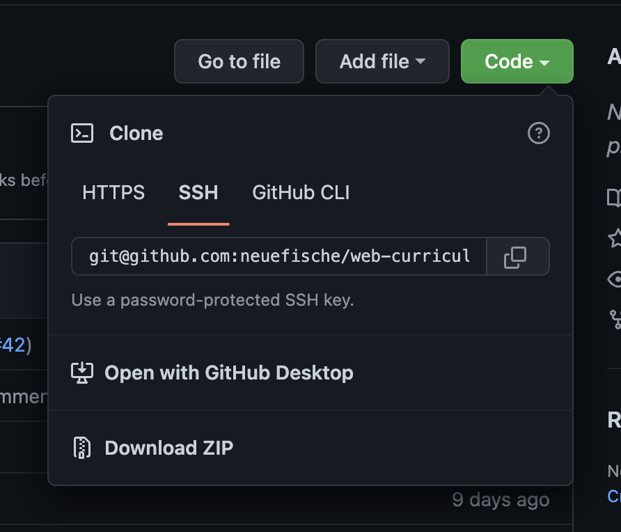

# Git CLI & remote

## Learning Objectives

- using version control locally to create repositories and commits
- understanding different states of files
- synchronizing local repositories with remote repositories

---

## Git CLI

After installing Git on your machine, you can create repositories and commits locally. You can also
synchronize your local repository with a **remote** repository (i.e. on GitHub).

### Creating local repositories

To turn a folder into a git repository you need the following git command:

```shell
cd path/to/my/folder
git init
```

> ❗️ Do not initialize a git repository inside another git repository!  
> To check if a folder has already been initialized you can run the following git command
>
> ```shell
> git status
> ```
>
> Not a git repo:
>
> ```shell
> fatal: not a git repository (or any of the parent directories): .git
> ```
>
> A git repo:
>
> ```shell
> On branch main
> nothing to commit, working tree clean
> ```

---

## States of files

On GitHub, we can create, modify and delete files, the same can be done via the terminal. To
understand how this works, we have to know about the different states a file can have.

### Untracked files

The file has not been added to git.

### Tracked files

Tracked files can be in different states:

| state     | description                        |
| --------- | ---------------------------------- |
| modified  | Has changes since the last commit  |
| staged    | Is included in the next commit     |
| committed | All changes have been saved in git |

---

## Committing in a local repository

We recommend executing the following git commands for every completed task:

> 💡 Hint: Commits help track your progress.  
> Commit early, commit often.  
> Make sure, that your code works as expected.

| Git command                      | Git task                                         |
| -------------------------------- | ------------------------------------------------ |
| `git status`                     | List all files that have changed and their state |
| `git add <filename>`             | Add a file to the stage                          |
| `git commit -m "Commit message"` | Create a commit including all staged files       |
| `git log --oneline`              | Show the commit history                          |




---

## Using commits as backups

You can always return to the last committed state of the entire project:

```sh
git restore .
```

You can also restore individual files:

```sh
git restore <file name>
```

---

## Connecting to a remote repository

This enables teams to work on the same remote repository and clone it locally. The remote repository
also serves as a backup.

### Connecting your local repository to a new remote repository

The first thing you need to do is create a new empty remote repository on GitHub. You will then see
some hints e.g. "...or push an existing repository from the command line". **Copy the commands from
GitHub** and execute them in your local project folder.

**Example:**

```
git remote add origin git@github.com:GitHubUsername/repository-name.git
git branch -M main
git push -u origin main
```

### Cloning a remote repository

You can create a copy of the remote repository on your local machine with the following command:

```shell
git clone <url>
```

> 💡 You can find the url of remote repositories on GitHub on the repository page. Please use the
> SSH url.



### Synchronizing local & remote repositories

| Git command | Git task                                    |
| ----------- | ------------------------------------------- |
| `git push`  | Upload content to the remote repository     |
| `git pull`  | Download content from the remote repository |

---

## Resources

- [Connect with SSH Docs on GitHub](https://docs.github.com/en/authentication/connecting-to-github-with-ssh/about-ssh)
- [Git SCM](https://git-scm.com/)
- [Git book](https://git-scm.com/book/en/v2)
- [Git Cheatsheet](https://training.github.com/downloads/github-git-cheat-sheet/)
